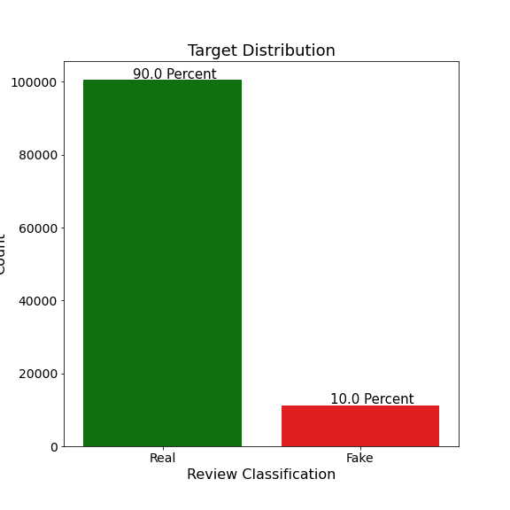
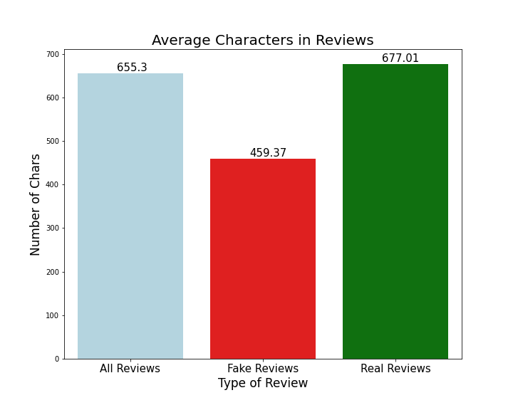
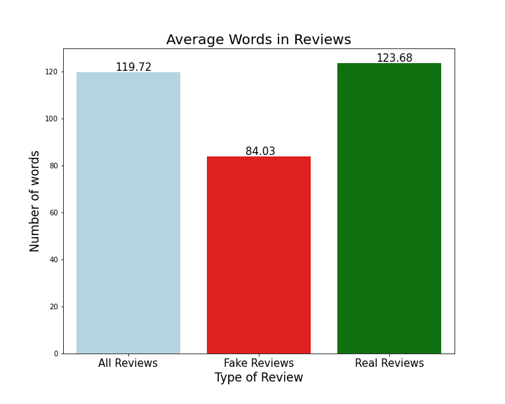
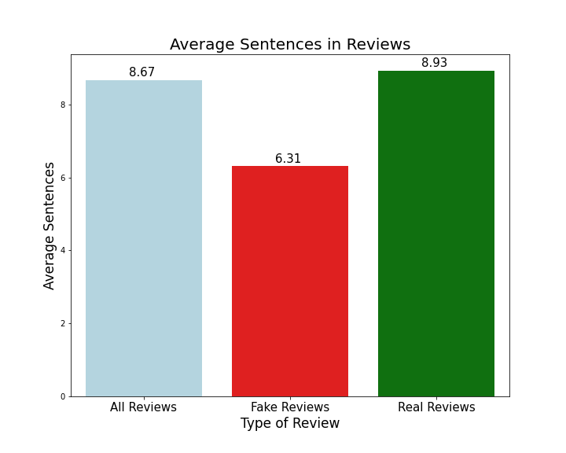
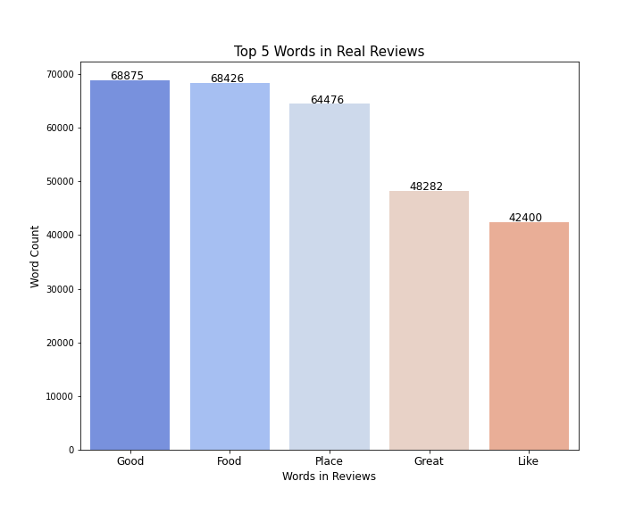
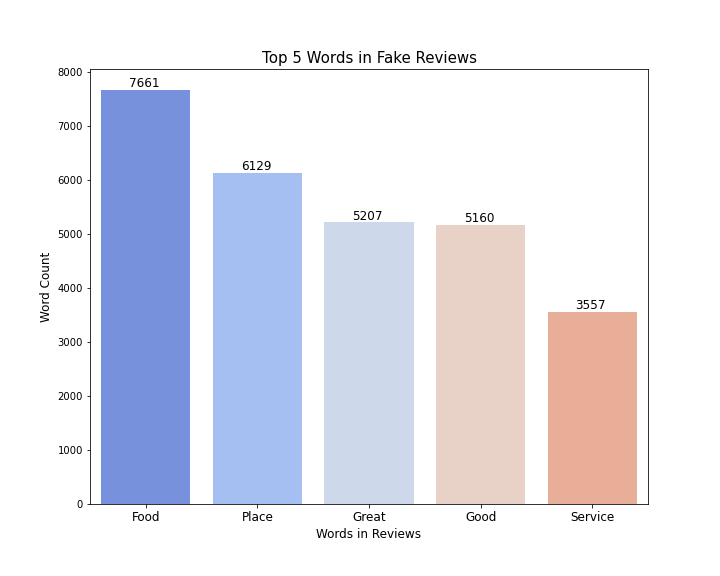
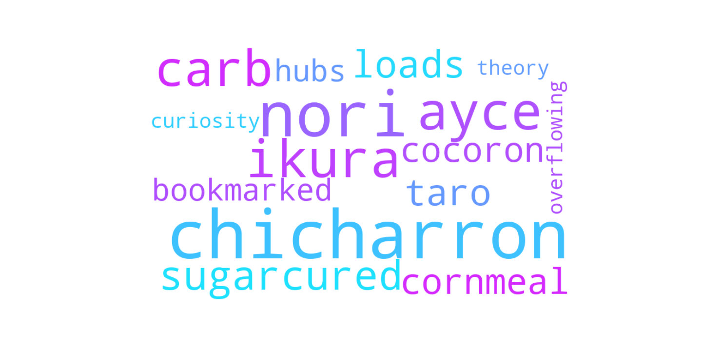
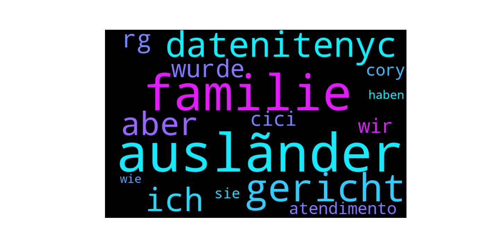

# Fake Review Detection
 

# Business Problem

How many times have you read reviews while searching for places to eat and not thinking twice about whether or not the review was left by a real person? I would think that answer is very often. Most of the time, we make snap decisions on a few of the reviews. Fake reviews can falsely hurt or boost a restaurants reputation on a review website, and deter customers from visiting restaurants. An extra star on somewhere like Yelp can increase revenue by 5-9 percent. This is false advertising. The intergity of the site is important, and people need to be able to trust the reviews they read. There are places you can go to purchase reviews for a business.

https://www.youtube.com/watch?v=KdG81QKdga0 is a link to a video where 5 star reviews are sold to businesses. There are Facebook groups where you can go to find people who will boost your score, with the 'elite' reviews being premium since they cannot be removed. This video is from September of 2020. This is why the fake reviews are so hard to spot. They are actual people writing these for money boosting the business rating. This leads to the question, can you also pay a group of people to bring down a competing business?

https://money.cnn.com/2014/09/24/smallbusiness/purposefully-bad-yelp-reviews/index.html is a story about a man in Richmond,California who offered 25% off of his pizza for NEGATIVE reviews. This was done as a publicity stunt for the restaurant and increased traffic.
 
A model using NLP(Natural Language Processing) can be used to flag reviews as they are posted to be peer reviewed by a person. Since this is designed to flag a review to be peer reviewed, it will be better for the model to predict more false positives (or reviews that the model thinks is fake but is not). False negatives are something to avoid. This type of scoring will want to maximize recall. This model can help protect any review website wanting to improve review integrity.

# Data

Over 110k rows of data obtained from a data set located on kaggle. This data is labelled as real reviews and fake reviews. Current data was also scraped from Yelp.

This is the distribution of the data in the dataset from Yelp. About 1800 rows of local Yelp reviews were scraped to run the model on.

# EDA

The reviews labelled  fake are usually shorter than the reviews labelled as real. Perhaps this could be because the star rating is more important than the actual review itself. This would make sense if a review were bought just for a boosted star. The reviewer would put less effort into writing the review because they know it does not really matter, plus they have to make up experiences which take more effort than is worth. People with real reviews will have no problem describing their experience because the experience actually happened.

Less characters are used over all in the reviews that are fake.

The same goes for words, there are less in a fake review.

So again, the fake reviews have less sentences on average.

These are the top 5 words that are in real reviews that are not unique to real reviews. Good food are the two most common words, probably coming in that order in the reviews.

These are the top 5 words that appear in fake reviews not unique to fake reviews. I find it fascinating that good falls to fourth in this graph and is topped by great. In the real review top 5, good is the most mentioned word. I think great is used more in the fake reviews because they are trying to sell you on their review rather than focus on being authentic. Also service breaks in the top 5 here, because service is another term you can throw in for any review for a restaurant. There is not much thought putting the service was great in a review. 

These are words from real reviews that do not show up in fake reviews. To my surprise, these are all real words. 'Chicharrón is a dish generally consisting of fried pork belly or fried pork rinds. Chicharrón may also be made from chicken, mutton or beef.'. I originally thought this was not a real word. Nori is seaweed, ayce stands for all you can eat. Ikura is red caviar. Cocoron is 'Soba Noodle, Ramen and Alternative Japanese Curry'. 

These are words that show up only in fake reviews. Not to my surprise, most of the words are foreign. They seem to be mostly German actually. datenitenyc also appeared in there.

# Model

Please note that the iterative modelling process can be found in the Model NB under working notebooks.

The metric chosen was recall, which ended up being 69%. This is designed to flag a review as real/fake when it comes in, so it will not be auto deleted. The review will then be peer reviewed by an employee or further investigated. The biggest challenge for the model in the beginning was detecting fake reviews. The biggest improvement the model showed with recall scores was undersampling the majority class(real reviews). The undersampler either merged or deleted rows to balance the distribution out with the minority class. As more fake reviews were caught, false positives also increased. 

While the model does a good job at catching most of the fake reviews, there are alot of false positives. The precision could be improved on this model.

# Conlcusion

With the help of machine learning and natural language processing, the problem of fake reviews can be minimized. With access to more data such as user activity and the location of the user are things that could further help the model catch fake reviews. 

